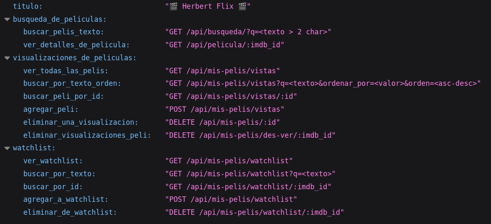

# HerbertFlix
**HerbertFlix** es un sitio de reseñas de películas al estilo de Letterboxd/IMDB. El proyecto está conformado por un backend hecho con JavaScript y Node, y un frontend vanilla usando componentes visuales de Bootstrap.

## Funcionalidades
- **Búsqueda de películas a través de la API externa.**
- **Agregar y quitar películas de Watchlist**
- **Agregar y borrar una o varias reseñas de una o varias películas**
- **Busqueda filtrada y ordenamiento segun distintos atributos en listado de logs del usuario**

---


## Tecnologias
### Backend:
- **Node.js y Express** para API interna
- **JavaScript** para funciones Helper de busqueda/filtrado/ordenamiento
- **Axios** para requests HTTP a la API externa OMDB
- **CORS** para para permisos cross-join de front a back
- **Escritura y lectura de archivos JSON locales** para emular registros de un usuario
- **OMDB API** - API externa para conseguir información de películas

### Frontend:
- **HTML y CSS** para estructura y estilos
- **JavaScript** para lógica de aplicación
- **Bootstrap** para componentes visuales

## Endpoints de API interna


## Como ejecutar el proyecto
1. Clonar el repositorio:
```bash
git clone https://github.com/titoCo12/proyecto-HerbertFlix.git
```

2. Obtener Key para usar OMDB API en : https://www.omdbapi.com/:
```javascript 
#en archivo helper de OMDB
const OMDB_API_KEY = '<Tu Key>'
```

3. Iniciar Back:
```bash
cd backend
npm install
npm start
```

4. Abrir Front (en una segunda terminal):
```bash
# Recomiendo como alternativa usar Live Server en VS Code
# alternativa http server:
cd frontend
# Una vez para instalar
npm install -g http-server
# Siempre para correr
http-server frontend -p 5500
```

## Autor
**Joaquín Fuentes** - Proyecto libre para entrevista técnica
