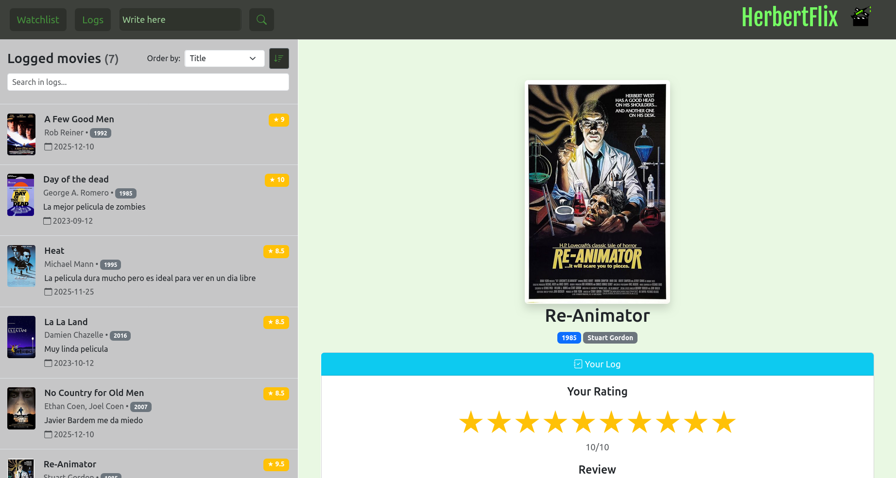

# HerbertFlix
**HerbertFlix** es un sitio de reseñas de peliculas al estilo de Letterboxd/IMDB. El proyecto esta conformado por un Backend hecho con Javascript y Node, y un Frontend vanilla usando componentes visuales de Bootstrap. 

---

## Tecnologias
### Backend:
- **Node.js y Express** para API interna
- **Javascript** para funciones Helper de busqueda/filtrado/ordenamiento
- **Axios** para requests HTTP a la API externa OMDB
- **CORS** para para permisos cross-join de front a back
- **Escritura y lectura de archivos JSON locales** para emular registros de un usuario
- **OMDB API** - API externa para conseguir información de peliculas

### Frontend:
- **HTML y CSS** para estructura y estilos
- **JavaScript** para lógica de aplicación
- **Bootstrap** para componentes visuales

## Endpoints de API interna

